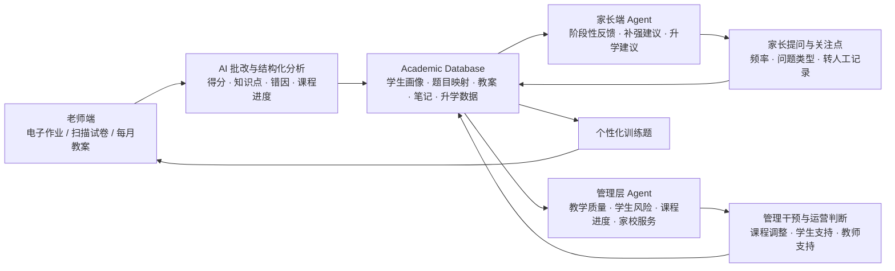

# Spectra 三端 Agent 与数据库页面说明

## 整体叙事顺序

建议顺序：

1. Teacher Agent
2. Parent Agent
3. Management Agent
4. Academic Database I: 数据资产积累
5. Academic Database II: 数据闭环流转

这个顺序更自然：先让听众理解产品分别服务谁、解决什么问题，再解释背后的数据底座如何搭建。数据库页放在三端之后，不是弱化数据库，而是让它承担“为什么前面这些 Agent 能成立”的解释作用。

核心闭环：

> 老师端通过自动批改产生结构化学情数据；家长端把这些数据转化成阶段性反馈、补强建议和升学建议；管理层端把个体数据汇总成教学质量、学生风险和运营视图；三端共享同一套学校 Academic Database，而这套数据库会随着每一届学生、每一次作业、每一次考试和每一次升学结果持续积累。

---

## Slide 1: Teacher Agent

### 页面目标

让听众理解 Spectra 的产品入口不是“让老师多用一个聊天机器人”，而是从老师最刚需、最高频、最耗时的批改场景切入。

这一页要回答：

- 老师为什么愿意用？
- 数据从哪里自然产生？
- 为什么后面的家长端和管理层端有数据基础？

### 推荐标题

**老师端agent**

### 推荐副标题

**把批改工作转化成可行动的学情分析**

### 页面主文案

老师不需要额外录入大量数据，只需要确认 AI 不确定的结果。

### 推荐页面结构

左右两栏。

左栏标题：

**Teacher Workflow**

左栏内容：

1. 上传电子作业 / 扫描试卷
2. 检查 AI 标记的不确定题目
3. 查看学生报告、班级报告和定制练习

右栏标题：

**Agent Output**

右栏内容：

- 每道题得分与错题定位
- 知识点掌握度与错因标签
- 学生个人报告与班级报告
- 针对薄弱知识点生成训练题
- 向家长和管理层同步结构化学情数据

### 底部强调句

**每一次批改，都在为学校沉淀可被 Agent 调用的学情数据。**

---

## Slide 2: Parent Agent

### 页面目标

让听众理解家长端不是给家长展示所有原始数据，而是把老师端产生的学情数据转化成家长真正能理解、能行动的反馈。

这一页要回答：

- 家长为什么愿意用？
- 家长到底会问什么？
- 如何避免李老师提到的“too much information”问题？

### 推荐标题

**家长端agent**

### 推荐副标题

**把学情数据转化成家长能理解的判断和建议**

### 页面主文案

Spectra 基于作业、考试和训练数据，定期向家长反馈孩子当前的学术水平、主要弱点、补强方向和升学风险。

### 推荐页面结构

三段式。

第一段：

**孩子现在怎么样？**

- 当前学术水平
- 成绩趋势
- 是否存在下滑风险
- 与目标成绩的差距

第二段：

**接下来怎么补？**

- 主要薄弱知识点
- 针对性训练题
- 是否需要额外课程支持
- 本周/本月学习建议

第三段：

**和大学申请有什么关系？**

- 当前成绩与目标专业的匹配度
- 预测分风险
- 历史申请数据对比
- 专业方向和升学路径建议

### 页面核心表达

**平时给摘要，风险时提醒，主动问时再解释细节。**

这句话很重要。它回应了李老师的担心：家长看到太多原始信息会焦虑，反而增加学校沟通压力。

### 可放在页面中的示例家长问题

家长可以问：

- 我孩子最近数学水平怎么样？
- 他现在最薄弱的知识点是什么？
- 接下来两周应该重点练什么？
- 如果要补课，应该补哪个方向？
- 这个成绩会不会影响申请目标大学？
- 和往年申请同类专业的学生相比，他现在处于什么位置？

### 底部强调句

**家长端不展示碎片数据，而是给出阶段性判断和行动建议。**

### 这一页不要强调

- 不要说家长可以看到所有老师记录。
- 不要把家长端讲成“实时监控孩子”。
- 不要主动推送过细的错题和课堂细节。

---

## Slide 3: Management Agent

### 页面目标

让听众理解管理层端不是“监控老师”，而是把老师端和家长端自然产生的数据汇总成学校级运营视图。

这一页要回答：

- 校长/教务/年级主任为什么需要这个系统？
- 管理层能看到哪些以前看不到的东西？
- 这个视图如何帮助学校提升教学质量和升学结果？

### 推荐标题

**管理层端Agent**

### 推荐副标题

**把教学数据转化成学校级运营视图**

### 页面主文案

当作业、考试、训练、家长问答和教学计划持续进入系统，Spectra 可以为管理层生成学校整体运行视图，帮助他们提前发现教学质量、学生风险、课程进度和家校服务中的问题。

### 推荐页面结构

建议做成五个模块卡片。

#### 1. 教学质量

- 哪些班级成绩提升或下滑
- 哪些学科 topic 普遍薄弱
- 哪些教学班和年级需要支持
- 自动对比作业、测验和 mock 趋势

#### 2. 课程进度

- 每月教学方案进入系统
- 对比 term plan 与实际作业/考试覆盖情况
- 识别课程进度落后或 topic 覆盖不足
- 在 mock / AS / A2 前提前预警

#### 3. 学生风险

- 成绩掉档风险
- 长期薄弱知识点
- 作业完成和订正异常
- 申请目标与当前成绩不匹配

#### 4. 教师工作与支持

- 批改量和报告生成情况
- 学生提升情况
- 老师反馈是否及时
- 哪些老师需要教学支持，而不是简单排名

#### 5. 家校服务

- 哪些家长频繁提问
- 哪些问题反复出现
- 哪些班级家校沟通压力最大
- 哪些问题需要老师或管理层介入

### 页面核心表达

**管理层不需要查看每一道题或每一条聊天记录，而是看到学校哪里有效、哪里有风险、哪里需要介入。**

### 可放在页面中的示例管理层问题

管理层可以问：

- 这个年级本月最需要关注的学科是什么？
- 哪些班级 mock 前存在掉档风险？
- 哪些 topic 全年级掌握最差？
- 哪些家长问题最集中？
- 哪些班级家校沟通压力最大？
- 哪些学生的当前成绩和申请目标不匹配？

### 底部强调句

**Management Agent turns scattered academic signals into a school-level operating system.**

或中文：

**管理层端把分散的教学信号，变成学校级的运营判断。**

### 这一页不要强调

- 不要说“监控老师”。
- 不要说系统替学校评价老师。
- 不要把管理层端讲成只看 dashboard，而要强调它能帮助学校提前干预。

---

## Slide 4: Academic Database I

### 页面目标

解释 Spectra 为什么不是一次性的工具，而是在为学校沉淀长期可复用的数据资产。这里要强调：每所学校都会逐渐拥有自己的教学、学生、家校和升学数据库，这些数据会越积越厚，成为学校自己的核心财富。

这一页要回答：

- Agent 为什么能回答越来越准确？
- 学校自己的数据库由哪些数据组成？
- 为什么这些数据会随着使用自然积累？
- 为什么数据库会成为学校资产和产品壁垒？

### 推荐标题

**数据库**

### 推荐副标题

**让学校拥有自己的专属数据库**

### 页面主文案

Agent 的能力取决于它能访问什么数据。Spectra 会把学校日常教学中产生的作业、考试、教案、笔记、家校互动和升学结果持续沉淀下来，形成每所学校自己的 Academic Database。系统使用越久，数据库越完整，Agent 给老师、家长和管理层的建议也越有价值。

### 推荐页面结构

建议做成 2x3 或 3x2 数据资产矩阵，每个卡片代表一类会持续积累的数据。

#### 1. 作业数据

- 学生电子作业
- 每道题得分
- 知识点掌握情况
- 错因标签和订正情况

#### 2. 考试数据

- 扫描试卷和 AI 批改结果
- mock / 月考 / 阶段测验
- 班级、年级、学科趋势
- 预测分和成绩风险

#### 3. 教案与课程数据

- 老师每月上传教学方案
- term plan 与 topic 覆盖
- 课程进度和考试节点
- 学科组教学安排

#### 4. 学生笔记与学习过程

- 学生笔记和错题整理
- 个性化练习完成情况
- 订正质量和训练反馈
- 长期知识点画像

#### 5. 家校互动数据

- 家长与 Agent 的提问频率
- 高频关注问题
- 转人工和老师反馈记录
- 班级家校服务压力

#### 6. 往届升学数据

- 往届学生成绩与预测分
- 申请专业和大学方向
- offer 与最终录取结果
- 当前学生与历史样本对比

### 页面核心表达

**数据库不是一次性导入的资料库，而是学校在每一次教学、批改、反馈和申请中持续沉淀的资产。**

### 底部强调句

**The database compounds with every cohort.**

或中文：

**每一届学生、每一次考试和每一次申请，都会让学校的数据库变得更有价值。**

### 这一页不要强调

- 不要写成纯技术数据库表。
- 不要让人感觉第一天就必须录入所有历史数据。
- 不要把数据库讲成静态资料库，要强调它会持续积累。

---

## Slide 5: Academic Database II

### 页面目标

解释数据库如何以低摩擦方式生成，并且如何在老师端、家长端和管理层端之间形成闭环。这里要强调：除了老师每月上传教学方案之外，核心数据主要来自作业、考试和 Agent 互动，不需要老师额外做大量手动输入。

这一页要回答：

- 数据从哪里进入系统？
- 为什么不依赖大量人工录入？
- 老师端产生的数据如何被家长端和管理层端复用？
- 为什么这是一套闭环，而不是三个孤立 Agent？

### 推荐标题

**数据闭环**

### 推荐副标题

**从日常教学动作中自动生成三端 Agent 的数据底座**

### 页面主文案

Spectra 的数据不是额外填出来的。老师端的作业和考试批改会自动生成学生知识点画像；这些数据被家长端用于阶段性反馈和补强建议，被管理层端用于教学质量、学生风险和课程进度判断；家长互动和管理层干预又会回流到数据库，形成持续更新的学校学术数据闭环。

### 推荐页面结构

建议这一页主要放一张闭环图，配少量说明文字。

### 图旁边可以放的三句解释

**1. 老师端是主要数据入口**

作业、考试和每月教案会自动生成最核心的学情和课程数据。

**2. 家长端和管理层端复用同一套数据**

同一份批改数据既可以生成家长反馈，也可以生成管理层的教学质量和学生风险视图。

**3. 数据会持续回流**

家长提问、训练完成情况、管理干预和升学结果会继续回到数据库，让系统越用越准确。

### 页面核心表达

**除了每月上传教学方案，Spectra 不要求老师额外维护一套复杂系统；数据库从作业、考试和互动中自然生长。**

### 底部强调句

**One workflow, three agents, one compounding database.**

或中文：

**同一条教学工作流，支撑老师、家长和管理层三个 Agent，并持续沉淀学校自己的数据库。**

### 这一页不要强调

- 不要让闭环看起来需要复杂系统集成才能跑起来。
- 不要把飞书/钉钉接入作为第一阶段前提。
- 不要暗示老师每天都要手动填数据；重点是自动批改、每月教案和自然互动回流。

---

## 五页之间的过渡句

### Teacher Agent → Parent Agent

每一次批改都会沉淀学生的知识点、错因和成绩趋势。基于这些数据，家长 Agent 可以把老师端产生的学情数据转化成家长能理解的反馈和建议。

### Parent Agent → Management Agent

当这些学情反馈、家长问题和训练结果覆盖到整个年级和学校，管理层就能看到更高层的教学质量、学生风险和家校服务压力。

### Management Agent → Academic Database I

老师、家长和管理层的 Agent 并不是三个孤立工具。它们共享同一套 Academic Database，而这套数据库会随着作业、考试、教案、家校互动和往届升学结果持续积累。

### Academic Database I → Academic Database II

数据库的价值不只在于“有什么数据”，更在于这些数据如何低摩擦进入系统，并在老师端、家长端和管理层端之间形成闭环。

---

## 这五页合起来要传达的核心观点

Spectra 的核心不是“给每个人一个聊天机器人”，而是：

> 用 AI 批改切入老师真实工作流，把作业和考试转化为结构化学情数据，再用这套数据服务家长反馈、学校管理和升学决策。

更短版本：

> From marking to data. From data to guidance. From guidance to school operations.
